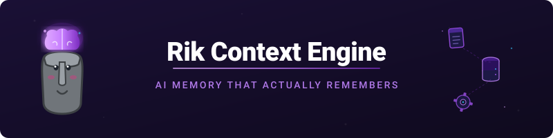
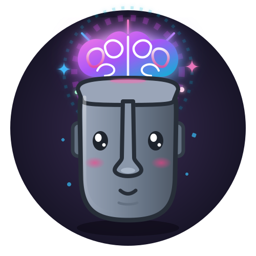

<div align="center">



<br/><br/>



# Rik Context Engine 🗿

**AI agents that actually remember.**

[](LICENSE)
[](https://www.python.org/)
[](#)
[](#)
[](#)
[](#)
[](#)

*Persistent, hierarchical memory for AI agents — so they stop forgetting and start learning.*

[Quick Start](#-quick-start) · [Features](#-features) · [Architecture](#-architecture) · [Docs](docs/) · [Turkce Rehber](docs/yeni-ozellikler-rehberi.md)

</div>

---

## 🎯 The Problem

Every AI session starts from scratch. Chat with an assistant today, and tomorrow it's a complete stranger.

The industry keeps building bigger context windows. But bigger windows don't solve the **memory problem** — they just delay it.

> **Context windows ≠ Memory.**
>
> - 128K context window = you can fit a novel, not a relationship
> - Long conversations get truncated, losing the most important context
> - No differentiation between "what happened" and "what matters"
> - Zero learning across sessions

---

## 💡 The Solution: 3-Tier Human Memory Architecture

Rik Context Engine mirrors how humans actually remember things:

```
┌─────────────────────────────────────────────────────────┐
│              📝 Episodic Memory                          │
│         Session-level, short-term, high-fidelity         │
│     "What happened in this conversation last week?"      │
└─────────────────────────────────────────────────────────┘
                          ↓ consolidate
┌─────────────────────────────────────────────────────────┐
│              🧩 Semantic Memory                          │
│         Long-term structured knowledge (SQLite)          │
│     "What do I know about this user/project?"            │
│             + ChromaDB vector search                     │
└─────────────────────────────────────────────────────────┘
                          ↓ proceduralize
┌─────────────────────────────────────────────────────────┐
│              ⚙️ Procedural Memory                        │
│           Skills, workflows, how-to knowledge            │
│        "How do I deploy to the production server?"       │
└─────────────────────────────────────────────────────────┘
```

---

## ✨ Features

### 🧠 Intelligent Context Window Management
- **Importance scoring** — Automatically scores messages based on user mentions, decisions, tool results
- **Smart pruning** — Removes low-importance content first, never loses grounding context
- **Coherence validation** — Ensures pruned context remains logically coherent
- **Priority tiers** — TIER_0 (protected) → TIER_3 (low-priority)

### 📦 3-Tier Memory System
- **Episodic**: Session snapshots, conversation highlights, ephemeral facts
- **Semantic**: Structured knowledge (subject → predicate → object), SQLite + ChromaDB embeddings
- **Procedural**: Captured skills, workflows with success rates, step-by-step instructions

### 🔗 Knowledge Graph
- Entity + relationship model (PERSON, PROJECT, CONCEPT, TOOL...)
- BFS pathfinding between entities
- Semantic vector search via Ollama embeddings

### 📋 Task Decomposition
- Goal → executable task graph with dependency resolution
- Parallel execution groups with rollback support

### 🔄 Self-Reflection Loop
- Post-interaction analysis: what went well/wrong
- Category-tagged lessons with severity tracking

### 🆕 Latest: v0.3.0

| Feature | What it does |
|---------|-------------|
| 🧠 **Shared Memory** (#108) | Multi-agent, tenant-isolated memory sharing |
| 💾 **Backup & Doctor** (#105) | Atomic backups + `riks doctor` integrity checks |
| ⚡ **Task Execute** (#107) | MCP tool for running goals with timeout enforcement |

> 📖 [Turkce rehber: bu ozelliklerin jargonsuz anlatimi](docs/yeni-ozellikler-rehberi.md)

---

## 🏗️ Architecture

```
src/riks_context_engine/
├── memory/
│   ├── episodic.py          # 📝 Session-level JSON store
│   ├── semantic.py          # 🧩 SQLite + ChromaDB
│   ├── postgres.py          # 🐘 Optional PostgreSQL backend
│   ├── procedural.py        # ⚙️ Skills & workflows
│   └── embedding.py         # 🔗 Ollama embedder
├── context/
│   └── manager.py           # 🎯 Intelligent pruning
├── tasks/
│   └── decomposer.py        # 📋 Goal → task graph
├── graph/
│   └── knowledge_graph.py   # 🔗 Entities + relationships
├── reflection/
│   └── analyzer.py          # 🔄 Self-improvement
├── multi_tenant.py          # 🏢 Tenant isolation
├── integrity.py             # 🩺 Health checks
└── cli/
    └── main.py              # 💻 `riks` command
```

---

## 🚀 Quick Start

### Python (Local)

```bash
# Clone
git clone https://github.com/vopsiton/riks-context-engine.git
cd riks-context-engine

# Virtual environment
python -m venv .venv && source .venv/bin/activate

# Install
pip install -e ".[dev]"

# Try it
python -c "
from riks_context_engine import *
from riks_context_engine.memory import EpisodicMemory, SemanticMemory, ProceduralMemory
from riks_context_engine.context import ContextWindowManager

# Add a memory
mem = EpisodicMemory()
mem.add('Vahit prefers Turkish in technical discussions', importance=0.9)

# Use context manager
ctx = ContextWindowManager(max_tokens=50_000)
ctx.add('user', 'Deploy to production', importance=0.8, is_grounding=True)
print(ctx.get_summary())
"
```

### 🐳 Docker

```bash
# Build & run
docker-compose up dev

# Verify
docker-compose exec dev python -c "from riks_context_engine import *; print('OK')"
```

---

## 💽 Storage Backends

| Tier | Storage | Why |
|------|---------|-----|
| 📝 Episodic | JSON file | Fast writes, session-scoped |
| 🧩 Semantic | SQLite + ChromaDB | Relational queries + vector search |
| ⚙️ Procedural | JSON file | Human-readable, easy to edit |
| 🔗 Knowledge Graph | SQLite | Graph queries with foreign keys |
| 🐘 Semantic (alt) | PostgreSQL | Shared, multi-process, horizontally-scaled |

> PostgreSQL backend: `pip install riks-context-engine[postgres]`
> Apply schema: `POSTGRES_DSN=... python scripts/migrate_postgres.py`

---

## ⚙️ Configuration

```bash
cp .env.example .env
```

| Variable | Default | Description |
|----------|---------|-------------|
| `OLLAMA_HOST` | `http://localhost:11434` | Ollama server for embeddings |
| `OLLAMA_MODEL` | `gemma4-31b-q4` | Default LLM for task decomposition |
| `CHROMA_HOST` | `localhost` | ChromaDB server for semantic search |
| `DATA_DIR` | `/app/data` | Data storage directory |

---

## 🧪 Development

```bash
pytest              # Run tests
ruff check src/     # Lint
mypy src/           # Type check
pre-commit run --all-files  # Pre-commit hooks
```

---

## 📊 Project Status

| Metric | Status |
|--------|--------|
| **Version** | v0.3.0 |
| **All Issues** | ✅ CLOSED (11/11) |
| **All PRs** | ✅ MERGED (5/5) |
| **UAT** | ✅ 484 PASS, 71 SKIP, 0 FAIL |
| **Production** | ✅ DEPLOYED |

See [PROJECT_CLOSURE.md](./docs/PROJECT_CLOSURE.md) for full closure report.

---

## 📜 License

[AGPL-3.0](./LICENSE) — share the source if you build on it.

---

<div align="center">

*Built with 🗿 by [opsiton](https://github.com/vopsiton) for the Rik AI ecosystem.*

</div>
