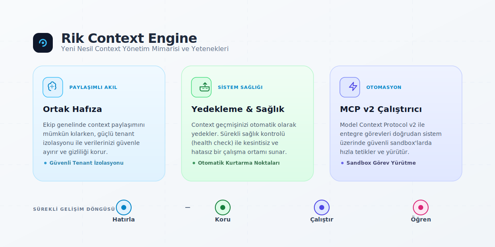
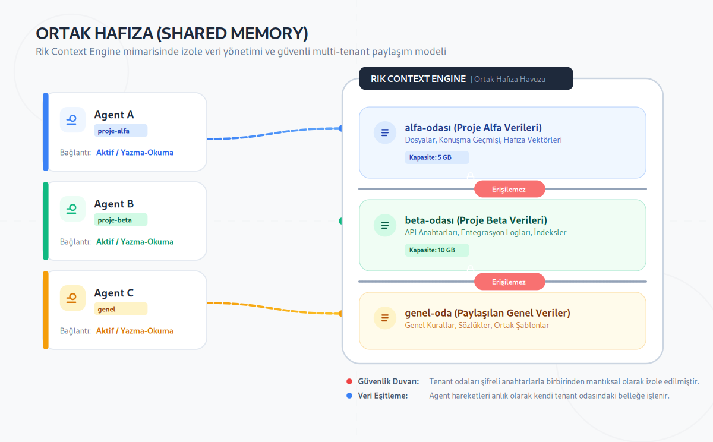

# Rik Context Engine — 3 Yeni Güç, Sadece Türkçe

> **19 Ağustos 2026 sprinti** — #108 (Ortak Hafıza), #105 (Yedekleme + Sağlık Kontrolü), #107 (MCP v2).  
> Bu döküman geliştirici olmanızı gerektirmez. "Ne işe yarıyor, beni neden ilgilendirir?" sorularına gündelik dille cevap verir.



---

## Bir dakikalık özet

Rik Context Engine, AI agent'larınızın hafızasını tutan bir motor. Bu sprintte üç şey değiştirdik:

| # | Özellik | Tek cümle |
|---|---------|-----------|
| #108 | **Ortak Hafıza** | Birden çok agent aynı bilgiyi paylaşıyor, ama kimse kimin odasına giremiyor |
| #105 | **Yedekleme + Bütünlük** | Verileriniz periyodik olarak yedekliyor, "bozuldu mu?" sorusuna tek komutla cevap alıyorsunuz |
| #107 | **MCP v2 (task_execute)** | Agent'larınız artık sadece hatırlatmıyor — doğrudan görev çalıştırıp sonucu geri alıyor |

Kısacası: Rik eskiden **hatırlayan** bir motordu. Artık hatırlıyor, kendini koruyor **ve iş de yapıyor.**

---

## 🧠 Ortak Hafıza (#108)

### Sorun neydi?

Her AI agent'ın kendi özel defteri vardı. Bir agent öğrendiğini diğerine anlatamazdı. Aynı şirkette çalışan iki asistan, birbirine "öğrenilmiş şeyleri" aktaramıyordu; her şey sıfırdan başlıyordu.

### Ne yaptık?

Agent'lara **aynı bilgi havuzunu kullanma** yeteneği verdik — ama bir şartla: her tenant (yani her proje, her müşteri, her "oda") kendi verisini tutuyor ve **diğer odalara erişilemiyor.**

Günlük hayattan örnek: ofisteki panoları düşünün. Herkes ortak panoyu görebilir, ama muhasebenin kilitli dolabına pazarlama ekibi bakamaz. Ortak Hafıza da aynı kuralı dijital ortamda uyguluyor.



### Siz için ne anlama geliyor?

- Birden fazla agent çalıştırıyorsanız, aralarında bilgi aktarımı artık **kurallı** ve **izole**.
- Tek bir agent kullanıyorsanız bile, verileriniz tenant etiketiyle korunuyor — karışma riski yok.
- Ekstra kurulum yok; MCP isteklerinde `tenant_id` göndermeniz yeterli.

---

## 💾 Yedekleme ve Sağlık Kontrolü (#105)

### Sorun neydi?

AI hafızası zamanla biriken, **geri gelmesi çok zor** bir varlık. Bir disk hatası ya da bozulmuş veri dosyası, haftalarca biriken bilgiyi silebilirdi. Ve en kötüsü: *bozulduğunu fark etmemek* — sessizce çürüyen bir veri.

### Ne yaptık?

İki araç ekledik:

1. **Yedekleme** — Verilerinizi tek komutla yedekliyoruz. İsterseniz 6 saatte bir otomatik yedek de alabiliyorsunuz (cron ile, kurulum rehberinde).
2. **`riks doctor`** — Veri bütünlüğü kontrolü. "Dosyalarım sağlam mı, en son yedek nerede?" sorusuna tek bakışta cevap: her şey iyiyse ✅, bir sorun varsa *hangi dosyada* olduğunu gösterir.

### Siz için ne anlama geliyor?

- "Beklenmedik veri kaybı" korkusu büyük ölçüde azalıyor — çünkü yedek var.
- Sessiz bozulma da yakalanabiliyor — çünkü doktor kontrolü var.
- Ekstra yazılım gerekmiyor; iki komut: yedekle ve kontrol et.

---

## ⚡ MCP v2 — Görev Çalıştırma (#107)

### Sorun neydi?

Rik'e "şunu hatırla" ya da "şunu not et" diyebiliyordunuz. Ama "şu işi yap, sonucu ver" diyemiyordunuz. Hafıza motoruydu, iş yapan motor değil.

### Ne yaptık?

MCP protokolünün yeni sürümüne (`task_execute` aracı) geçtik. Artık bir agent, Rik'e **gerçek bir görev** verebiliyor: "son 5 notu özetle", "şu veriyi analiz et" gibi. Rik görevi alıyor, süre sınırı içinde çalıştırıyor ve sonucu agent'a geri gönderiyor.

### Güvenlik ağı

- **Zorunlu süre sınırı:** Görev sonsuza dek çalışamaz. Aşılacak olursa "zaman yetmedi" der, sistemi kilitlemez.
- **Düzenli hata yönetimi:** Bir şey ters giderse sistem çökmez, anlaşılır bir hata mesajı döner.
- **Tenant izolasyonu:** Her agent kendi görev kuyruğunda çalışır; birinin yoğunluğu diğerini beklemede tutmaz.

### Siz için ne anlama geliyor?

- Rik artık sadece hafıza deposu değil; **kolları sıvayan** bir yardımcınız.
- Agent'larınız arasında otomasyon zincirleri kurabilirsiniz: biri araştırır, diğeri özetler, üçüncüsü kaydeder.

---

## Üçü birlikte ne işe yarıyor?

```
   🧠 HATIRLA ──► 💾 KORU ──► ⚡ ÇALIŞTIR
        ▲                        │
        └─────── öğren ──────────┘
```

- **Hatırlama** artık *güvenli paylaşım* ile birlikte geliyor (Ortak Hafıza).
- **Hatırladıklarınız** kaybolmuyor, bozulmuyor (Yedekleme + Sağlık Kontrolü).
- **Hatırladıklarınızı** eyleme dönüştürebiliyorsunuz (Task Execute).

Bu üçlü, Rik Context Engine'i "hafıza kutusu"ndan "ekip üyesi"ne dönüştürüyor.

---

## Detaylar isteyenler için

- Kod değişiklikleri ve PR bağlamları: [#108](https://github.com/vopsiton/riks-context-engine/issues/108), [#105](https://github.com/vopsiton/riks-context-engine/issues/105), [#107 / PR #150](https://github.com/vopsiton/riks-context-engine/issues/107)
- Mimari detaylar: [`ARCHITECTURE.md`](ARCHITECTURE.md)
- API yüzeyi: [`API.md`](API.md)
- Yedekleme/geri yükleme: [`BACKUP_RESTORE.md`](BACKUP_RESTORE.md)

---

*Bu döküman 19 Ağustos 2026 sprint kapanışı için hazırlandı.*
